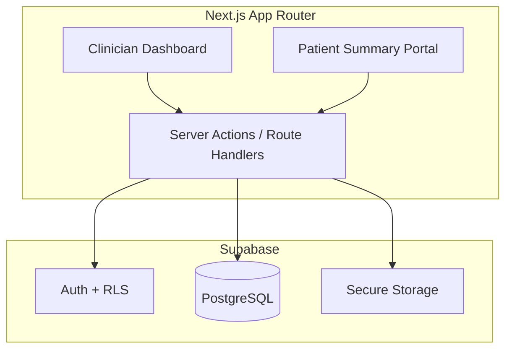

# Physiotherapy Assessment & Patient Tracking Web App

## Context

Greenfield project — only spec files exist today:
- [`core_behavious.txt`](c:\Users\rites\Desktop\digphy\core_behavious.txt) — validation, PHI, audit, RBAC, consent rules
- [`doc_id.txt`](c:\Users\rites\Desktop\digphy\doc_id.txt) — full data model (Patient, Encounter, SOAP, Progress, Documents, Audit)

**Your choices:**
| Decision | Choice |
|---|---|
| Scope | MVP+ (patients, SOAP, progress charts, docs, goals/plans, audit) |
| Stack | Next.js + Supabase |
| Audience | Event demo (ship fast, polish later) |
| Patient portal | Read-only summary (pain, home exercises, next appointment) |
| i18n | English only for V1 |

---

## Architecture



**Why this stack for a demo:** Supabase gives auth, Postgres, file storage, and Row Level Security in one place — critical for PHI handling without building infra from scratch.

---

## Project Structure (to be created)

```
digphy/
├── app/
│   ├── (auth)/login/
│   ├── (clinician)/
│   │   ├── dashboard/
│   │   ├── patients/[id]/
│   │   │   ├── page.tsx          # patient profile + history timeline
│   │   │   ├── encounters/new/   # SOAP form (multi-step wizard)
│   │   │   └── progress/         # charts + add entry
│   │   └── layout.tsx
│   ├── (patient)/my-summary/     # read-only portal
│   └── api/                      # audit hooks, doc upload
├── components/
│   ├── soap/                     # Subjective, Objective, Assessment, Plan sections
│   ├── charts/ProgressChart.tsx
│   └── ui/                       # shadcn components
├── lib/
│   ├── supabase/                 # client + server helpers
│   ├── validators/               # Zod schemas from doc_id.txt
│   └── audit.ts                  # write audit_log on every read/update
├── supabase/migrations/          # SQL schema + RLS policies
└── types/                        # TypeScript types mirroring YAML schema
```

---

## Database Schema (PostgreSQL via Supabase)

Core tables mapped from [`doc_id.txt`](c:\Users\rites\Desktop\digphy\doc_id.txt):

| Table | Key fields | Notes |
|---|---|---|
| `profiles` | `id`, `role`, `full_name`, `clinic_name` | Extends `auth.users`; roles: Physiotherapist, Assistant, Admin, Patient |
| `patients` | All patient fields + `consent_signed`, `consent_date`, `consent_document_id` | Mandatory per core_behavious |
| `encounters` | Header fields + `subjective`, `objective`, `assessment`, `plan` as **JSONB** | JSONB keeps demo velocity; structured enough for forms |
| `progress_entries` | Time-series: `metric_key`, `value`, `unit`, `source` | Powers charts |
| `documents` | `document_id`, `type`, `storage_reference` | No PHI in filenames |
| `audit_logs` | Every CREATE/READ/UPDATE/DELETE/EXPORT | Required by core_behavious |

**RLS policies (essential for demo credibility):**
- Clinicians/Admin: full access to their clinic's patients
- Patient role: read-only on own `patients` row + linked progress + home program + next follow-up
- All tables: deny by default, grant per role

---

## Feature Breakdown

### 1. Auth & Roles
- Supabase email/password auth (magic link optional later)
- On signup, assign role via `profiles.role`
- Middleware in Next.js protects `(clinician)` vs `(patient)` routes
- Seed script: 1 demo clinician + 2 sample patients for the event

### 2. Patient Registry
- List/search patients (name, phone, diagnosis)
- Create/edit patient form with **mandatory field validation** from core_behavious:
  - `patient_id`, `consent.signed`, contact info, primary diagnosis
- Patient detail page: demographics, comorbidities, meds, allergies, consent status badge

### 3. Encounters + SOAP Notes (core assessment flow)
Multi-step wizard form matching doc_id.txt sections:

1. **Encounter header** — type, location, date/time, confidentiality
2. **Subjective** — chief complaint, HPI, pain (VAS 0–10), social history, goals
3. **Objective** — vitals (range-validated), ROM, MMT, functional tests (TUG, 6MWT)
4. **Assessment** — problem list, working diagnosis (mandatory), red flags toggle
5. **Plan** — short/long-term SMART goals, treatment plan, interventions, modalities, next follow-up

Validation via **Zod schemas**:
- ISO 8601 dates
- Numeric ranges (VAS 0–10, MMT 0–5, vitals bounds)
- Enums for controlled fields (encounter_type, sex, ambulatory_status, etc.)

### 4. Progress Tracking & History
- Add progress entries from encounter or dedicated progress page
- Predefined metric keys: `pain_vas`, `rom_knee_flexion_deg`, `tug_sec`, `six_mwt_m`, custom
- **Line charts** (recharts) per metric over time on patient profile
- Encounter timeline: chronological list of all visits with SOAP summaries

### 5. Documents & Consent
- Upload consent forms, images, reports via Supabase Storage
- Store `document_id` reference only (no PHI in object keys — use UUID paths)
- Consent upload linked to patient record; block treatment encounters if `consent.signed !== true`

### 6. Audit Logging
- `lib/audit.ts` helper called from every server action:
  - `logAudit({ userId, action, entity, entityId, ip })`
- Clinician-only audit log viewer (simple table, filterable by patient/date)

### 7. Patient Summary Portal (read-only)
Route: `/my-summary` for logged-in patients showing:
- Current pain score (latest `pain_vas` entry)
- Home program text from latest encounter plan
- Next follow-up date
- Progress sparkline (pain trend only — no raw clinician notes)

---

## UI / UX for Event Demo

- **shadcn/ui + Tailwind** — clean clinical look, fast to build
- Clinician dashboard: today's patients, recent encounters, quick "New Encounter" CTA
- Patient card with status chips (consent ✓, red flags ⚠)
- Mobile-responsive (physios often use tablets in clinic)
- Pre-loaded **demo data**: 2 patients with 3–4 encounters each, progress charts populated

---

## Validation & Governance (from core_behavious.txt)

Enforced in Zod + DB constraints + UI:

| Rule | Implementation |
|---|---|
| Mandatory fields before treatment | Form + server-side guard on encounter create |
| ISO 8601 dates | Zod `z.string().datetime()` / date regex |
| Numeric ranges | Zod `.min()/.max()` on vitals, VAS, MMT |
| PHI minimization | UUID storage paths; no names in filenames |
| Audit every read/update | Server action wrapper |
| Consent required | Block encounter if unsigned |
| RBAC | Supabase RLS + Next.js middleware |

Deferred to post-demo: Hindi i18n, full retention policy UI, encryption config screens (Supabase handles at-rest/in-transit by default).

---

## Implementation Order

Build in this sequence so the demo always has something working:

1. **Scaffold** — Next.js 15, Supabase project, shadcn/ui, env setup
2. **Schema + RLS** — migrations, types, seed data
3. **Auth + roles** — login, middleware, profile setup
4. **Patient CRUD** — list, create, detail page
5. **SOAP encounter wizard** — the core assessment flow
6. **Progress entries + charts** — history visualization
7. **Documents upload** — consent + attachments
8. **Audit log** — wire into all mutations/reads
9. **Patient portal** — read-only summary
10. **Demo polish** — seed script, empty states, loading skeletons

---

## Environment & Deployment (Event Demo)

- **Supabase**: free tier project (Auth + DB + Storage)
- **Vercel**: deploy Next.js for shareable demo URL
- Env vars: `NEXT_PUBLIC_SUPABASE_URL`, `NEXT_PUBLIC_SUPABASE_ANON_KEY`, `SUPABASE_SERVICE_ROLE_KEY`
- Run seed script once before demo day

---

## Out of Scope for V1 (post-event backlog)

- Multi-clinic / tenant isolation
- Hindi and regional language support
- Telehealth video integration
- Device/API integrations for progress (`source: device`)
- Full patient access to clinician notes (consent-controlled)
- Export/print PDF reports
- Offline/PWA mode
