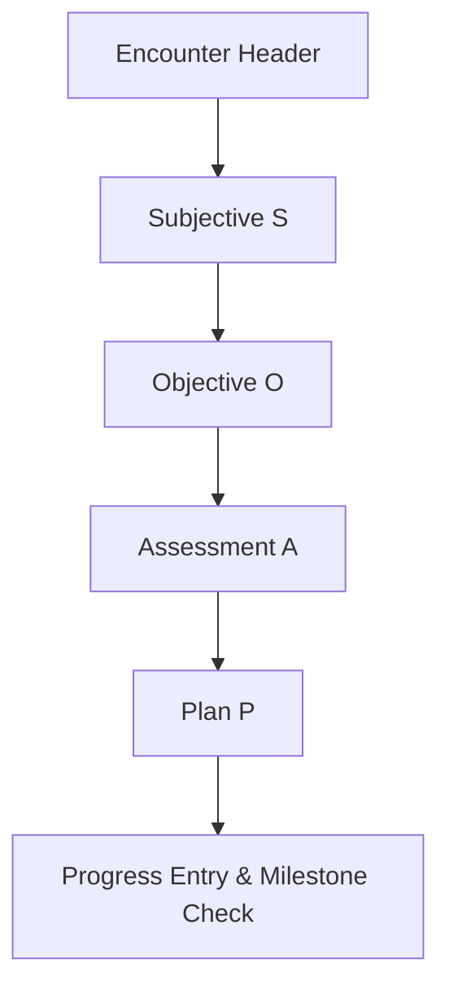

# Physiotherapy Assessment & Progress Tracker — Complete Reference & Blueprint (.md)

## Purpose and High-Level Objectives

**Purpose:** Build a multi-branch assessment and progress-tracking application for physiotherapy supporting five primary clinical specialties (**Orthopedic**, **Cardiorespiratory**, **Neurological**, **Geriatric**, and **Pediatric**). The app documents assessments, prescribes treatments, tracks longitudinal progress and milestones, and manages follow-up workflows and clinical data securely.

**Primary Users:**
- **Clinicians (Physiotherapists):** Perform assessments, define SOAP notes, set SMART goals, prescribe exercise programs, and monitor outcomes.
- **Assistants:** Record vitals, manage appointment queues, and track home program compliance.
- **Patients / Caregivers:** View personalized progress graphs, complete home exercise programs, log self-reported metrics, and check appointment schedules.
- **Administrators:** Oversee audit logs, clinical outcomes, clinic KPIs, and compliance.

**Core Goals:**
1. Standardized assessment workflows enforcing clear distinction between **Intake-Only Patient Data** and **Encounter SOAP Data**.
2. Longitudinal progress tracking with baseline anchoring and milestone automation.
3. Multi-branch specificity (Orthopedic, Cardiorespiratory, Neurological, Geriatric, Pediatric).
4. HIPAA/GDPR-compliant security, audit logging, and FHIR interoperability.

---

## Direct PDF Reference & Quotations

> [!NOTE]
> Reference Document: `ASSESSMENT.pdf` (Attached Reference)
> 
> Key Quotes from PDF:
> - *"ORHTOPAEDIC ASSESSMENT (SOAP NOTES: SUBJECTIVE, OBJECTIVE , ASSESSMENT AND PLAN)."* — Integrated as the foundational SOAP structure across all clinical branches.
> - *"The posture should be taken from maximum possible position Deviations at diff region should be checked."* — Integrated into the objective postural analysis framework (anterior, posterior, lateral views).

---

## 1. Intake & Consent — Core Intake Fields (Asked ONLY During New Patient Creation)

These fields capture baseline patient demographics, contact details, medical background, and initial consent upon registering a new patient into the system. **They are not re-prompted during regular encounter follow-ups.**

### Patient Intake Record
- `patient_id` (UUID) — Unique system identifier.
- `first_name`, `last_name` (String) — Patient full name.
- `date_of_birth` (ISO 8601 YYYY-MM-DD) — Date of birth.
- `sex` (Enum: Male | Female | Other) — Biological sex.
- `contact_phone` (String: +91-XXXXXXXXXX format) — Primary phone number.
- `email` (String, optional) — Patient email address.
- `address` (Text) — Residential address.
- `emergency_contact` (Object: name, phone, relationship) — Emergency point of contact.
- `caregiver` (Object: name, phone, relationship, optional) — Caregiver details for pediatric/geriatric/neurological patients.

### Clinical Background & Case Classification
- `primary_diagnosis` (String) — Primary medical/physiotherapeutic diagnosis (ICD-10 compatible).
- **`branch_specialty` (Enum: Orthopedic | Cardiorespiratory | Neurological | Geriatric | Pediatric)** — *Physiotherapist selects the primary clinical branch upon registration.*
- `comorbidities` (List of Strings) — Co-existing conditions (e.g., Diabetes, Hypertension, Osteoarthritis).
- `current_medications` (List of Strings) — Current pharmacotherapy.
- `allergies` (List of Strings) — Known drug/latex/environmental allergies.
- `mobility_aids` (List of Strings) — Canes, walkers, wheelchairs, orthoses.
- `consent_signed` (Boolean) — Signed baseline treatment and data processing consent.
- `consent_date` (ISO 8601) — Date consent was executed.

---

## 2. Universal Assessment Workflow — SOAP (Asked in 1st & Every Follow-up Encounter)

Every patient visit (whether initial or follow-up) records a structured SOAP encounter.



### S — Subjective
- **Chief Complaint:** Primary pain or functional impairment reported today.
- **History of Present Illness (HPI):**
  - Onset date (`onset_date`)
  - Mechanism of injury (Road traffic, direct, indirect, twisting, rotational, overuse, gradual)
  - Mode of onset (Sudden, Gradual, Insidious, Periodic)
  - Duration category (Acute < 6 weeks, Subacute 6–12 weeks, Chronic > 12 weeks)
- **Pain Assessment:**
  - Site / Body region
  - Pain type (Muscle, Joint, Nerve, Bone, Vascular)
  - Intensity: VAS / NRS Score (0 to 10)
  - Aggravating & Relieving factors
- **Patient Goals:** Patient-stated functional targets for recovery.

### O — Objective
- **Vitals:** Heart Rate (bpm), Blood Pressure (mmHg), Respiratory Rate (bpm), SpO₂ (%), Temperature (°C).
- **General Condition & Sensorium:** Alertness, orientation, physical appearance.
- **Ambulatory Status:** Independent, With Aid, Wheelchair, Bedridden.
- **Observation:**
  - *Posture Analysis:* Anterior, Posterior, Lateral views (checking deviations at shoulder, spine, pelvis, knees, feet as per `ASSESSMENT.pdf`).
  - *Gait Observation:* Barefoot and with footwear/aids.
- **Palpation Findings:** Tenderness grading (0–4), Tone, Crepitus, Edema/Swelling.
- **Range of Motion (ROM):** Active ROM (AROM), Passive ROM (PROM) in degrees, End-feel assessment (Soft, Firm, Hard, Empty).
- **Manual Muscle Testing (MMT):** MRC Grade (0 to 5) for key muscle groups.
- **Neurological Screen:** Sensation mapping, Reflexes (hypo/hyper/normal).
- **Branch-Specific Objective Tests:** (See Section 3).

### A — Assessment
- **Problem List:** Prioritized list of physical impairments and functional limitations.
- **Working Diagnosis:** Clinical impression by physiotherapist.
- **Red Flags Screening:** Presence of urgent warning signs requiring medical referral.
- **Clinical Impression:** Summary of prognosis and rehabilitation potential.

### P — Plan
- **SMART Goals:** Short-term (1–4 weeks) and Long-term (1–6 months) targets with baseline and target metric values.
- **Treatment Plan:**
  - Modalities (TENS, IFT, Ultrasound, Cryotherapy, Moist Heat).
  - Therapeutic Exercises (reps, sets, hold time in seconds, progression rules).
  - Patient & Caregiver Education items.
  - Prescribed Home Exercise Program (HEP).
- **Monitoring & Follow-up:** Review interval (days), next follow-up appointment date.

---

## 3. Branch-Specific Assessment Checklists & Measures

| Branch | Key Objective Assessments | Standardized Outcome Scales | Baseline & Follow-up Cadence | Target Population |
| :--- | :--- | :--- | :--- | :--- |
| **Orthopedic** | AROM/PROM (goniometry), MMT (MRC 0–5), Joint play, Special tests (Lachman, McMurray, Drawer, Hawkins), Limb length, Girth measurement | VAS/NPRS, WOMAC, KOOS, DASH, LEFS, TUG | Baseline, Weekly / Biweekly, Discharge | Adolescents to Adults |
| **Cardiorespiratory** | 6MWT / ISWT distance, Chest auscultation, Respiratory Rate, SpO₂, Borg Dyspnea scale, Chest expansion, Cough strength, Sputum characteristics | 6MWT distance (m), Borg score (0–10), SpO₂ % on room air / O₂ | Baseline, Weekly, Post-intervention | Adults & Elderly |
| **Neurological** | Modified Ashworth Scale (MAS spasticity 0–4), Berg Balance Scale, Sensation mapping, Reflexes, Coordination (finger-to-nose), Gait speed | Berg Balance Score (0–56), MAS grade, FIM, MoCA/MMSE | Baseline, Biweekly / Monthly | Post-stroke, TBI, SCI, Neuropathy |
| **Geriatric** | Timed Up & Go (TUG), 30s Chair Stand test, ADL / IADL Index, Fall risk screening, Orthostatic vitals, Polypharmacy check | TUG time (sec), ADL score, 30s Chair repetitions | Baseline, Monthly, Post-fall | Older Adults (65+) |
| **Pediatric** | Gross Motor Function Measure (GMFM-88/66), Peabody Developmental Motor Scales (PDMS-2), PEDI, Tone assessment, Milestone checklist | GMFM %, PEDI score, Milestone attainment level | Baseline, Monthly / Quarterly | Infants to Adolescents |

### Branch Details

#### 1. Orthopedic Checklist
- **Special Tests:** Lachman, Anterior/Posterior Drawer, McMurray, Apley, Hawkins-Kennedy, Neer, Thomas test, Ober test.
- **Measurements:** True vs Apparent limb length (cm), Joint circumference/girth (cm), Swelling grade.
- **Joint Play & End-Feel:** Hypermobile, Normal, Hypomobile; Hard/Soft/Firm end-feel.

#### 2. Cardiorespiratory & Cardiovascular Checklist
- **Hemodynamics & Vitals:** Blood Pressure (Systolic/Diastolic resting & post-exercise), Heart Rate (Resting & Post-exercise), Respiratory Rate, SpO₂.
- **Chest & Cardiac Exam:** Auscultation (Vesicular, Crackles, Wheezes, Absent), Cardiac Auscultation (Murmurs, Gallops S3/S4, Rubs), Chest Expansion (cm), Cough Strength, Sputum characteristics.
- **Symptom & Dyspnea Evaluation:** Chest Pain Characteristics (Onset, Duration, Intensity 0–10, Quality, Radiation), Dyspnea Assessment (Borg CR10, NYHA Functional Class I–IV, mMRC Grade), Peripheral Edema Presence & Pitting Grade (0 to 4+).
- **Diagnostics & Biomarkers:** Electrocardiogram (ECG) Results, Echocardiogram Findings (EF %, Valves), Stress Test / Exercise Tolerance Test (METs), Holter Monitor Data, Coronary Angiography Findings, Cardiac Biomarkers (Troponin, CK-MB), Heart Rate Variability (HRV SDNN ms).
- **Labs & Metabolic Risk Factors:** Lipid Profile (Total Cholesterol, HDL, LDL, Triglycerides), Blood Glucose (Fasting, HbA1c), Body Mass Index (BMI kg/m²), Inflammatory Markers (hs-CRP, ESR), Sleep Apnea Screening (STOP-Bang Score), Cardiovascular Risk Factors (Smoking, HTN, DM, Family Hx), Cardiac Medications & Rehab History.

#### 3. Neurological Checklist (13 Clinical Domains)
- **Subjective & Intake:** Handedness/Dominance, IP No., Date of Admission (DOA), Provisional Diagnosis, Referred By, Lab Reports, Detailed ADL Difficulties (Ambulation, Bed activities, Dressing, Eating, Toilet activities), Weakness (Side, Site, Duration in ADL), Sensory/Balance Problems (falls, dizziness, visual disturbances), Extended Present/Past/Family/Social/Environmental History.
- **Higher Mental Functions:** Level of Consciousness (Alert, Drowsy, Stupor, Coma), Glasgow Coma Scale (GCS 3–15), Behavior, Emotional Status, Orientation (Time, Place, Person, Day, Year), Memory (Immediate, Short-term, Long-term), Calculation, Reasoning & Problem Solving, Judgement, Attention, Cognitive/Perceptual (Speech, Agnosia, Apraxia).
- **Cranial Nerve Examination:** Cranial Nerves I through XII (Olfactory, Optic, Oculomotor, Trochlear, Trigeminal, Abducens, Facial, Vestibulocochlear, Glossopharyngeal, Vagus, Spinal Accessory, Hypoglossal).
- **Sensory Examination:** Superficial Sensations (Pain, Temperature, Light Touch, Pressure), Deep Sensations (Proprioception, Kinesthesia, Vibration), Cortical Sensations (Graphesthesia, Stereognosis, Tactile Localization, 2-Point Discrimination).
- **Motor Examination & Synergies:** Modified Ashworth Scale (MAS spasticity 0–4), Deep Tendon Reflexes, Pathological Reflexes (Babinski, Hoffmann, Clonus), Oxford Muscle Power (MMT 0–5), ROM summary, Tightness, Voluntary Control (Bobath & Brunnstrom Stages 1–6).
- **Balance & Coordination:** Static/Dynamic Balance (Sitting & Standing), Berg Balance Scale (0–56, < 45 high fall risk), Coordination Tests (Finger-to-nose, Finger-to-finger, Dysdiadochokinesia, Knee-to-heel), Equilibrium Tests (Tandem, Sideways, Single leg stance).
- **Gait Examination:** Ambulation status, Step length (cm), Step width (cm), Stride length (cm), Stance time (sec), Cadence (steps/min), Gait deviations.
- **Autonomic Nervous System:** Sweat function tests (Ninhydrin, Galvanic skin resistance, Vasomotor/Sudomotor notes).
- **Functional Evaluation:** ADL performance index, Bowel & Bladder continent status.

#### 4. Geriatric Checklist
- **Mobility & Strength:** Timed Up and Go (TUG, seconds; > 12s indicates fall risk), 30-Second Chair Stand Test (repetition count).
- **Functional Independence:** Katz Index of ADL / Lawton IADL score.

#### 5. Pediatric Checklist
- **Motor Function:** GMFM-88 / GMFM-66 percentage score.
- **Functional Performance:** Pediatric Evaluation of Disability Inventory (PEDI) functional skills score.
- **Milestone Tracking:** Head control, Sitting independently, Crawling, Standing, Walking.

---

## 4. Data Model and JSON Schemas

### Core Entities
1. `Patients`: Demographic, contact, caregiver, primary diagnosis, `branch_specialty`, consent.
2. `Clinicians`: Accounts, roles, license numbers, clinic assignments.
3. `Encounters`: SOAP records tied to `patient_id` and `clinician_id`.
4. `Assessments`: Branch-specific measurement values.
5. `Treatments`: Modalities, exercise prescriptions, HEP instructions.
6. `Goals`: SMART goals linked to progress metrics.
7. `Milestones`: Key outcome targets and achievement dates.
8. `ProgressEntries`: Time-series data points (`metric_key`, `value`, `unit`, `date_time`).
9. `Appointments`: Scheduling, reminders, status.
10. `Documents`: Consent PDFs, diagnostic images, discharge reports.
11. `AuditLog`: Security logs (User ID, Action, Timestamp, IP).

### Example JSON Schema — Assessment Record

```json
{
  "$schema": "http://json-schema.org/draft-07/schema#",
  "title": "EncounterAssessmentRecord",
  "type": "object",
  "properties": {
    "encounter_id": { "type": "string", "format": "uuid" },
    "patient_id": { "type": "string", "format": "uuid" },
    "clinician_id": { "type": "string", "format": "uuid" },
    "branch_specialty": { 
      "type": "string", 
      "enum": ["Orthopedic", "Cardiorespiratory", "Neurological", "Geriatric", "Pediatric"] 
    },
    "date_time": { "type": "string", "format": "date-time" },
    "soap": {
      "type": "object",
      "properties": {
        "subjective": {
          "type": "object",
          "properties": {
            "chief_complaint": { "type": "string" },
            "pain_vas": { "type": "number", "minimum": 0, "maximum": 10 }
          },
          "required": ["chief_complaint", "pain_vas"]
        },
        "objective": {
          "type": "object",
          "properties": {
            "vitals": {
              "type": "object",
              "properties": {
                "heart_rate_bpm": { "type": ["number", "null"] },
                "spo2_percent": { "type": ["number", "null"] }
              }
            },
            "branch_specific": { "type": "object" }
          }
        }
      }
    }
  },
  "required": ["encounter_id", "patient_id", "clinician_id", "branch_specialty", "date_time", "soap"]
}
```

---

## 5. Progress Tracking, Milestones, KPIs, and UI Guidelines

### Progress Tracking Architecture
- **Time-Series Metric Store (`ProgressEntry`):** Every quantitative measurement (e.g. `pain_vas`, `knee_flexion_deg`, `6mwt_m`, `tug_sec`, `gmfm_pct`) is saved as a timestamped data point.
- **Baseline Anchor:** The first encounter assessment establishes the baseline value against which percentage changes ($\Delta\%$) are measured.
- **Milestone Triggers:** Automated triggers check if metric thresholds are met (e.g. $\ge 20\%$ improvement in 6MWT distance automatically marks Milestone M-102 as Achieved).

### Key Performance Indicators (KPIs)
- **Clinical KPIs:** Goal attainment rate (%), Average score improvement ($\Delta$), Days to milestone achievement.
- **Operational KPIs:** Appointment adherence rate, No-show rate, Average sessions to discharge.
- **Patient KPIs:** Home Exercise Program (HEP) completion rate, Patient-Reported Outcome Measures (PROM) trends.

### Dashboard UI Components
- **Patient Timeline Widget:** Interactive time-series line chart showing pain VAS, ROM, or functional scores over time, annotated with treatment changes and milestone achievements.
- **Clinician Dashboard:** Active patient list, red flag alerts, overdue follow-up reminders.
- **Patient/Caregiver Portal:** Simplified metric cards, home exercise video guides, upcoming visit details.

---

## 6. Follow-up, Treatment Templates & Data Governance

### Default Follow-Up Schedules
- **Orthopedic:** Weekly / Biweekly
- **Cardiorespiratory:** Weekly
- **Neurological:** Weekly / Biweekly
- **Geriatric:** Monthly
- **Pediatric:** Monthly / Quarterly

### Automated Escalation Rules
- If 2 consecutive sessions are missed $\rightarrow$ Trigger Clinician Alert.
- If pain VAS increases by $\ge 3$ points or key functional metric drops by $> 15\%$ $\rightarrow$ Flag Urgent Clinical Review.

### Privacy, Security & Compliance
- **RBAC (Role-Based Access Control):** Restrict sensitive clinical data based on role (Physiotherapist vs Assistant vs Patient).
- **PHI Protection:** AES-256 encryption at rest, TLS 1.3 in transit. Pseudonymized filenames for uploaded documents.
- **Audit Logging:** Immutable record of every CREATE, READ, UPDATE, DELETE, and EXPORT action.
- **Interoperability:** HL7 FHIR Observation and Patient resource mappings for EHR integration.

---

## Quick Reference Summary

- **New Patient Creation Form:** Collects Intake demographics, contact info, emergency contacts, caregiver, medical/surgical history, comorbidities, allergies, consent, AND **Branch Specialty Selection**.
- **SOAP Encounter Form (1st & Every Follow-up):** Collects Subjective symptoms (pain VAS, HPI), Objective vitals, physical exams, posture/gait, and **Dynamic Branch-Specific Tests** (Orthopedic, Cardiorespiratory, Neurological, Geriatric, Pediatric), Assessment, and Plan with goals & follow-up scheduling.
